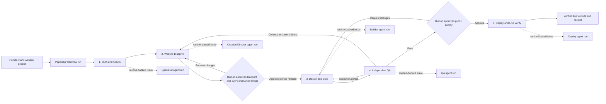

# Website Development Workflows on Paperclip

**Status:** Approved design baseline, awaiting owner review of this written specification

**Date:** 2026-07-21

**Branch:** `codex/workflows`

## 1. Decision

Paperclip's existing hidden Pipelines subsystem will become the fork's user-facing **Workflows** feature. We will preserve its proven engine and data model, expose it deliberately, and configure one real five-stage Website Development workflow on top of it.

This is a productization and configuration change, not a new orchestration engine.

The existing subsystem already provides the mechanics this workflow needs:

- ordered and explicitly connected stages;
- routine-backed automation when a work item enters a stage;
- normal Paperclip issues and agent runs as the execution mechanism;
- stage documents, linked work, artifacts, event history, retries, and idempotency ledgers;
- human-only approval gates;
- approve, reject, and request-changes transitions;
- version-aware approvals that become stale when material work changes.

Paperclip remains the control plane. Agents remain the execution layer.

## 2. Vocabulary and Compatibility Boundary

The user-facing product term is **Workflow**: a repeatable multi-stage journey that turns one request into a governed outcome.

For this first slice:

- visible navigation, headings, buttons, empty states, settings copy, and accessibility labels say **Workflow** or **Workflows**;
- the feature is available in the fork without requiring the undiscoverable `enablePipelines` experimental flag;
- existing internal TypeScript names, API routes such as `/pipelines`, permission keys, database tables, persisted events, and migration history remain unchanged;
- existing deep links continue to work.

This surface-only rename is intentional. A wholesale internal rename would add migration risk without improving the website journey.

The existing word **Cases** is not introduced into the normal Workflow UI. A user starts a **website project** or **workflow run**; the existing `pipeline_cases` record remains an internal implementation detail in this slice.

## 3. Scope

### In scope

1. Expose the existing subsystem as Workflows in the fork.
2. Remove the hidden/experimental discovery failure for Workflows.
3. Preserve the current engine behavior and compatibility seams.
4. Add the five reusable website-production skills needed by the stage agents.
5. Configure one real Website Development workflow in the owner's Paperclip company using the existing workflow settings and routine-backed automations.
6. Prove the complete journey with a real website project before opening a pull request to `main`.

### Out of scope

- a second workflow engine, queue, scheduler, or agent runtime;
- a generic DAG designer or cross-workflow marketplace;
- renaming database tables, REST routes, permission keys, or internal code symbols;
- redesigning unrelated Paperclip surfaces;
- importing the rejected greenfield/Company-Agents-3 runtime architecture;
- treating any previous Roma, Black Pepper, Wilton, or other generated site as an accepted visual-quality reference;
- automatic public deployment without explicit human approval.

## 4. Architecture

Each box is an existing Paperclip workflow stage. Entering an automated stage creates or dispatches an ordinary, inspectable Paperclip issue through the existing routine system. Stage outputs are saved as workflow documents, attachments, work products, comments, and links rather than hidden in prompts or transcripts.

## 5. The Website Development Workflow

The workflow has five production stages plus the engine's terminal Done and Cancelled states. The five production stages are the journey the user sees.

### Stage 1 — Truth and Assets

**Purpose:** establish a complete, source-faithful evidence base before any design decisions.

**Inputs**

- existing website URL and any additional owner-provided source material;
- company/project workspace;
- optional credentials or source locations explicitly supplied by the owner.

**Required work**

- crawl the complete reachable site, not only the homepage;
- retain URL-level provenance for every factual claim and reusable content block;
- inventory the real information architecture, page purposes, navigation, contact details, services, proof, legal content, and calls to action;
- download and inspect the company's real logo, favicon, photography, illustrations, icons, fonts, and other reusable brand assets;
- extract observed brand colors and typography while distinguishing explicit assets from inference;
- source additional candidates from approved sources such as Pexels and Pixabay where the source material is insufficient;
- visually inspect every candidate image rather than trusting filenames, metadata, or search relevance;
- reject images with embedded text, watermarks, broken crops, irrelevant subjects, misleading context, unusable resolution, or section-layout artwork masquerading as photography;
- do not invent claims, services, testimonials, addresses, team members, statistics, or brand assets.

**Outputs — Truth Pack**

- crawl manifest with status, title, page purpose, and canonical URL;
- fact and content ledger with provenance;
- current information-architecture map;
- brand asset inventory with local file or attachment references;
- observed brand-token sheet;
- image contact sheet containing every viable owned and sourced candidate;
- image-candidate ledger containing source URL, license/source class, dimensions, intended use, inspection verdict, and rejection reason where applicable;
- explicit unknowns and owner questions.

**Exit gate**

The pack is structurally complete, every included fact is traceable, every image has been visually inspected, and unresolved unknowns are visible. No creative work may silently fill evidence gaps.

### Stage 2 — Creative Director: IA, Content, and Visual Direction

**Purpose:** create one coherent Website Blueprint in which information architecture, content, imagery, and visual direction are designed together.

This stage is deliberately not split into a content plan followed by a design specification. Those decisions affect one another and must be made in the same reasoning pass.

**Required work**

- identify the site's genre, audience expectations, business objective, and recognizable conventions;
- study relevant references for principles and patterns, without copying a template or forcing the site into a predefined kit;
- define the complete multi-page route and navigation architecture;
- map every important source fact to a destination page and section;
- write or restructure complete page content using only supported source facts, marking any owner-supplied content distinctly;
- declare a strong creative concept and a single visual through-line;
- define visual rhythm across the entire scroll: recurring motifs, transitions, overlaps, changes of scale and density, image choreography, section connections, and intentional moments of contrast;
- specify every page and every section closely enough that the builder is executing a resolved direction rather than inventing one;
- select every production image from the inspected pool, define its crop/treatment/placement, and state why it belongs;
- preserve the real logo and recognizable brand colors unless the blueprint explicitly documents a reasoned extension;
- reject generic AI landing-page patterns, disconnected flat sections, decorative gradients without concept, arbitrary glass cards, repeated feature grids, invented logos, and placeholder imagery.

**Outputs — Website Blueprint**

One versioned document containing:

1. design-direction declaration;
2. site genre, audience, goals, and reference principles;
3. complete information architecture and route manifest;
4. complete content plan with source provenance;
5. global visual system and responsive behavior;
6. visual-rhythm/through-line rules;
7. page-by-page and section-by-section content plus design specification;
8. interaction and animation direction;
9. production image manifest with a preview of every selected image, source, crop/treatment, destination, alt-text intent, and rationale;
10. explicit unknowns, risks, and non-negotiable constraints.

**Mandatory human approval**

The owner reviews the complete Blueprint and a contact sheet of **every production image**. Approval pins the exact Blueprint revision, workflow item version, and image-manifest revision. A material change after approval invalidates it and returns the work to review.

The owner may approve, reject, or request changes. Build cannot start without approval.

### Stage 3 — Design and Build

**Purpose:** implement the approved Blueprint faithfully as a complete multi-page website.

**Required work**

- use the approved routes, content, real logo, brand system, and production images;
- implement all pages and navigation, not a compressed one-page substitute;
- preserve the declared through-line and visual rhythm across responsive breakpoints;
- use image assets exactly as approved unless a changed image is returned through Stage 2 approval;
- build semantic, accessible, responsive production code;
- avoid invented content and undocumented creative deviations;
- record necessary implementation deviations rather than hiding them.

**Outputs — Build Candidate**

- repository/worktree and exact commit reference;
- preview URL;
- route manifest;
- production asset manifest with file hashes or stable attachment references;
- desktop and mobile screenshots for every route;
- build, typecheck, lint, and relevant test results;
- deviation log linked back to the approved Blueprint.

**Exit gate**

All routes render, all required content and assets are present, the preview is reachable, and the evidence bundle is attached for independent QA.

### Stage 4 — Independent QA and Repair

**Purpose:** determine whether the Build Candidate is technically correct, source-faithful, visually coherent, and genuinely better than the existing site.

The QA agent must be different from the builder.

**Required checks**

- route, navigation, form, build, console, network, link, and asset integrity;
- desktop, tablet, and mobile behavior;
- accessibility fundamentals including structure, keyboard use, focus, contrast, labels, and alternative text;
- source-faithful content and absence of fabricated claims;
- real logo, brand colors, fonts, and approved image use;
- exact comparison of the production asset manifest to the approved image manifest;
- page completeness and multi-page information architecture;
- section flow, visual rhythm, hierarchy, spacing, typography, crop quality, and responsive composition;
- explicit anti-slop critique: generic patterns, excessive sameness, disconnected bands, weak focal points, arbitrary decoration, and recognizably machine-default composition;
- live-browser screenshots and an inspectable evidence report, not a prose-only assertion.

**Outputs — QA Report**

- pass/fail verdict by category;
- severity-ranked findings with route, viewport, screenshot, and reproduction evidence;
- blueprint clause or acceptance criterion violated;
- repair instructions that are specific enough for the builder to execute;
- final regression evidence after repairs.

**Repair routing**

- implementation defects return to Stage 3;
- creative-concept, information-architecture, content-plan, or image-selection defects return to Stage 2 and require a new human approval;
- each return creates a visible transition with the report attached;
- three unsuccessful repair cycles trigger human review rather than an unbounded agent loop.

### Stage 5 — Deploy and Live Verify

**Purpose:** publish exactly the approved candidate and prove the public result.

**Mandatory human approval**

Public deployment is an external action and requires explicit owner approval of the QA-passed candidate. Preview deployment may occur earlier when it is local/private and incurs no unapproved spend.

**Required work**

- deploy the exact QA-passed commit and asset set;
- capture provider deployment identity and immutable revision where available;
- verify the public URL, every route, navigation, forms, assets, metadata, favicon, robots/sitemap behavior where applicable, TLS, console, and critical responsive views;
- compare the live revision to the approved candidate;
- roll back or block completion if the deployed revision differs or smoke verification fails.

**Outputs — Deployment Receipt**

- public URL;
- deployed commit/revision and provider deployment ID;
- deployment timestamp;
- live route and smoke-test results;
- live screenshots at desktop and mobile widths;
- rollback reference;
- final status of Done only after live verification passes.

## 6. Skill Packaging

The useful website-production knowledge recovered from the earlier Company Agents work will be adapted into five self-contained Paperclip skills:

1. `website-truth-and-assets`
2. `website-creative-director`
3. `website-design-and-build`
4. `website-independent-qa`
5. `website-deploy-and-verify`

They will live in Paperclip's skills catalog so their instructions are versioned, inspectable, assignable, and reusable. The recovered knowledge is design input only; the new skills must use Paperclip's current issue, document, attachment, work-product, workspace, and approval contracts.

The Creative Director skill uses the corrected genre-grounded and toolkit-unconstrained method: choose the visual language the business and concept require. It must not resurrect the earlier kit-constrained version or use the rejected later websites as aesthetic targets.

Stage automation instructions remain concise: identify the stage contract, require the matching skill, name the inputs, name the required outputs, and prohibit advancing without the exit gate. The detailed craft belongs in skills rather than duplicated prompt blobs.

## 7. Real Configuration Strategy

The first implementation will not build a generic workflow-template marketplace or installer.

Instead, after the Workflows surface and skills exist, we will configure the real Website Development workflow through Paperclip's existing settings/API against the owner's selected company and project:

- create the workflow with the five production stages plus Done and Cancelled;
- enforce explicit transitions;
- attach one routine-backed automation to each production stage;
- select the actual specialist agent and project workspace for each stage;
- configure Stage 2 as the Blueprint review gate and Stage 4 as the QA review gate whose approval authorizes entry into Stage 5;
- configure request-changes edges exactly as described above;
- store stage artifacts in the workflow item and linked Paperclip issue;
- keep credentials in Paperclip secret bindings, never in stage instructions or documents.

This avoids introducing a new template subsystem before the one real journey proves what a reusable template must contain. The resulting working configuration and its stable, non-secret contract can be exported into a reusable installer in a later, separately approved slice if repetition warrants it.

## 8. State, Failure, and Safety Semantics

- Workflow transitions are authoritative; an agent completing its issue does not bypass the stage exit gate.
- Stage entry automation uses the existing automation ledger and idempotency behavior. Retry creates a visible retry record instead of duplicating invisible work.
- A failed stage remains visible and recoverable. It never silently advances.
- Human approvals are attached to a specific workflow-item version. Material changes invalidate prior approval.
- Agent output is untrusted until its required documents and evidence are persisted and the gate checks pass.
- All factual website content requires provenance from Stage 1 or an explicit owner-supplied marker.
- All production images require visual inspection in Stage 1 and exact human approval in Stage 2.
- Public deployment requires explicit owner approval and is never inferred from earlier approval of the Blueprint.
- Credentials, paid-service choices, domains, and spend remain owner-controlled.

## 9. Product Surface

The minimum user-facing change is:

- sidebar: **Workflows**;
- index: **Workflows**, **New workflow**, and workflow-aware empty/error copy;
- settings and item pages: Workflow terminology throughout visible copy;
- experimental settings: no hidden Pipelines toggle is required to discover or use Workflows in this fork;
- URLs remain compatible at `/pipelines/...` for this slice.

This is not an invitation to redesign the existing board. Functional copy and discoverability changes should reuse the current components and design tokens.

## 10. Proof Gates

### Gate A — Productization

- Workflows appears without manually editing instance configuration.
- No normal visible copy calls the feature Pipelines.
- Existing `/pipelines` deep links, APIs, data, and permissions still work.
- Targeted UI, route, and service tests pass.

### Gate B — Skill contracts

- all five skills validate in the Paperclip catalog;
- each skill uses current Paperclip artifacts and safety boundaries;
- the Creative Director contract contains IA, complete content, visual direction, visual rhythm, and every image decision in one Blueprint;
- image inspection and source-faithfulness rules are explicit and testable.

### Gate C — Configured real journey

- the Website Development workflow exists in the selected company;
- every stage has a real assigned agent, workspace, instructions, and transition policy;
- both human approval gates behave correctly;
- a request-changes decision returns work to the intended stage;
- stage documents and evidence remain visible from the workflow project.

### Gate D — End-to-end website proof

Using one real website project:

1. the crawl covers the real site and produces a provenance-complete Truth Pack;
2. the owner can inspect and approve the Website Blueprint and every production image;
3. the builder produces a multi-page preview using the real logo, colors, content, and approved imagery;
4. independent QA catches seeded or naturally occurring defects and routes repairs correctly;
5. no public deploy happens before owner approval;
6. the public deployment matches the approved commit and passes live verification.

A locally green unit test suite is necessary but not sufficient for Gate D.

## 11. Implementation Sequence

1. Productize the hidden subsystem as Workflows without changing its internals.
2. Port and validate the five stage skills.
3. Configure the real Website Development workflow with the owner-selected agents and workspace.
4. Run a private/preview end-to-end proof through QA.
5. Pause for explicit owner approval before public deployment.
6. Fix evidence-backed defects, rerun the affected stages, and only then prepare the branch and pull request for `main`.

No product code is implemented as part of this design document.
